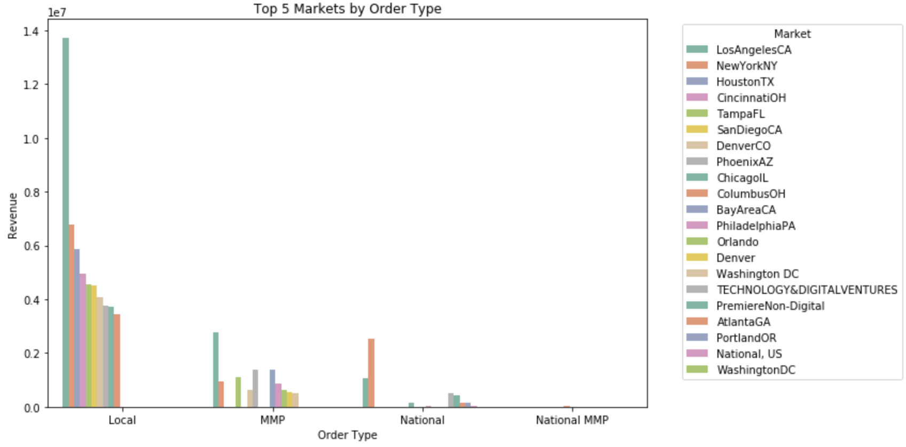
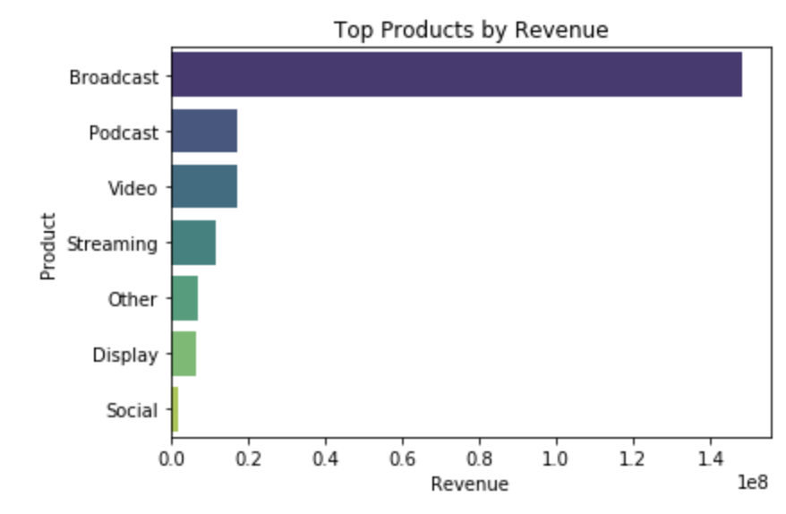
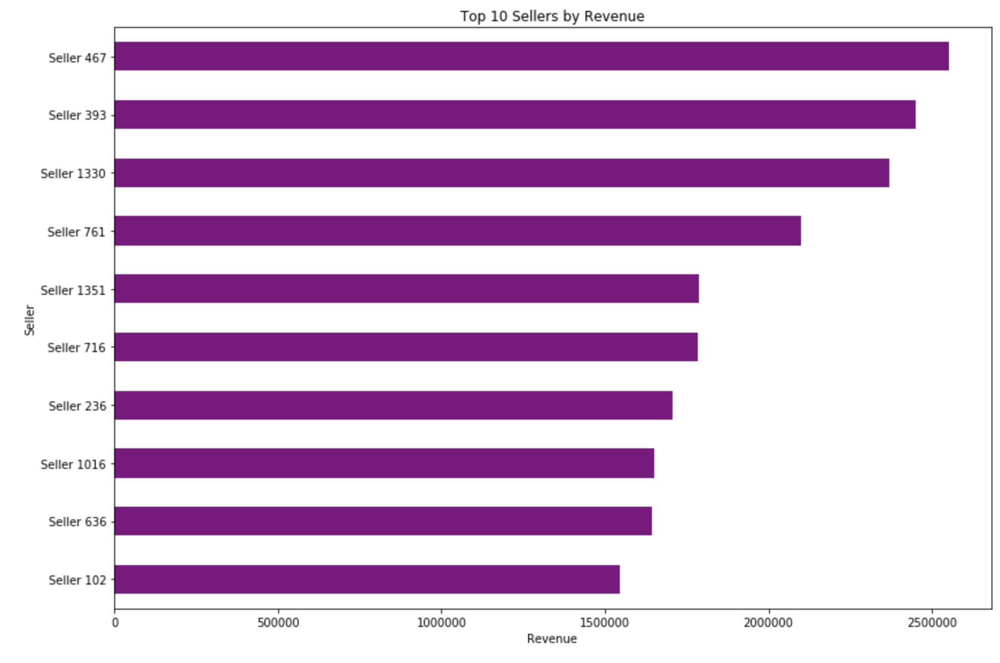
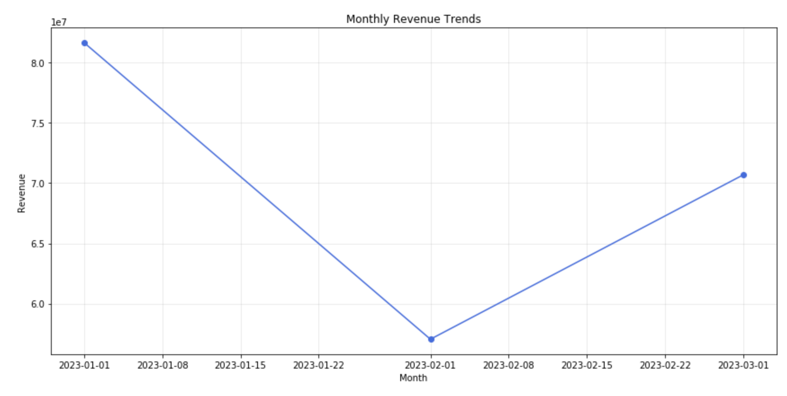
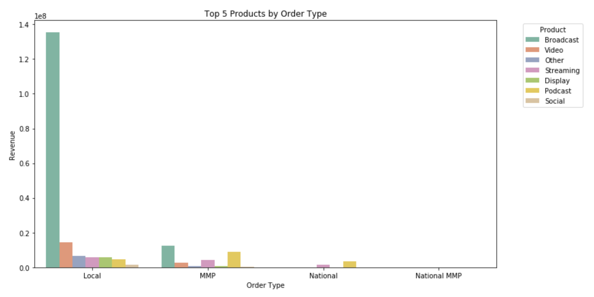
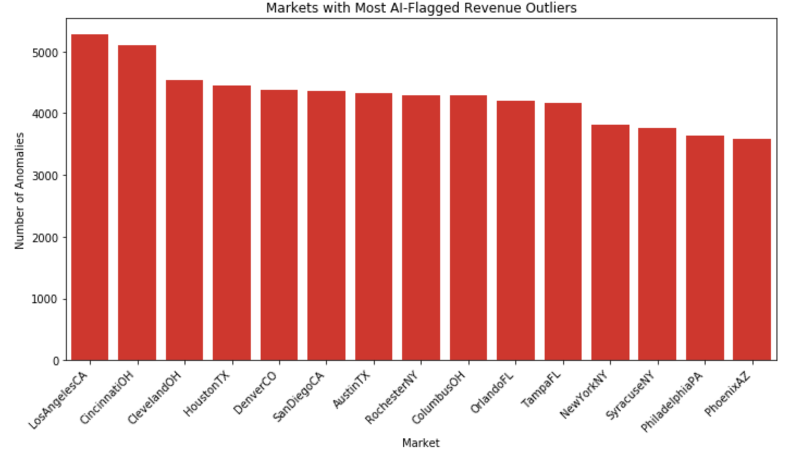
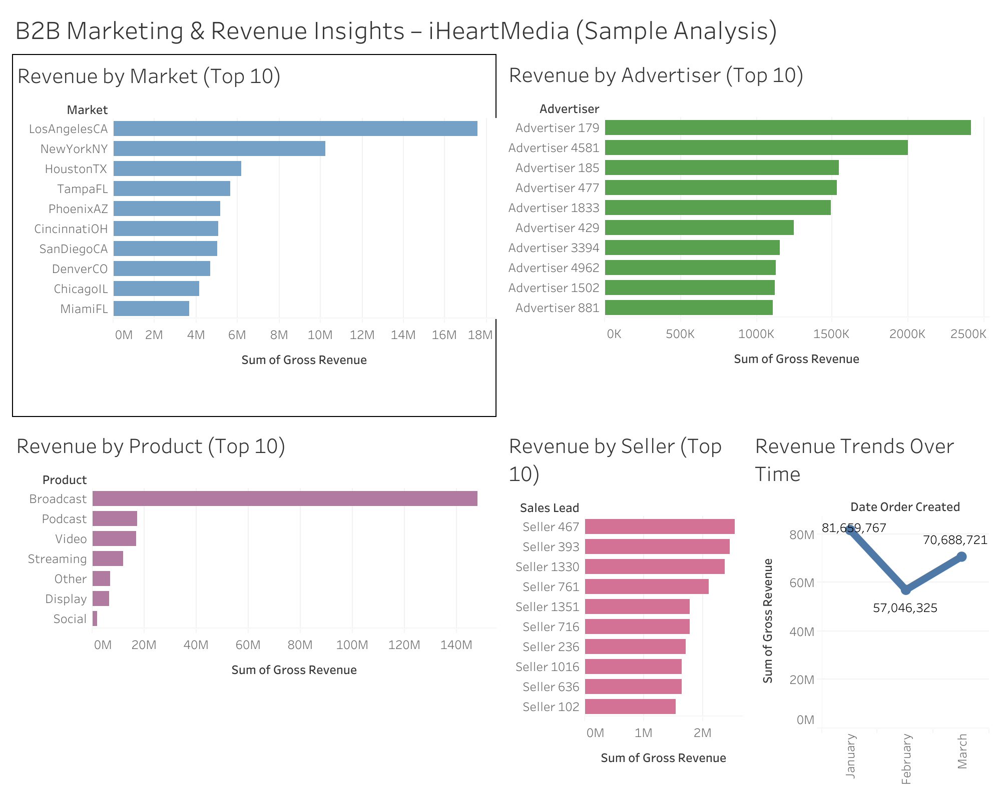

# 📊 B2B Marketing Revenue Insights  
*(Sample Analysis for iHeartMedia)*  

---

## 🎯 Objective  
Explore anonymized sales & revenue data (~300k rows) to identify performance trends and provide actionable insights for iHeartMedia’s B2B marketing and sales leadership.  

---

## ❓ Key Business Questions  

### 1. Which markets are stronger or weaker performers?  
Revenue is highly concentrated in a few big-city markets.  
- **Strongest:** Los Angeles, New York, Houston, Cincinnati  
- **Weakest:** LaGrange, Gallup NM, Defiance, New Haven CT  

📷 **Visual:**  
  

---

### 2. Which products or sellers stand out?  
- **Products:** Broadcast dominates, Podcast is emerging.  
- **Sellers:** Seller 467, 393, and 1330 together outperform nearly all others combined.  

📷 **Visuals:**  
  
  

---

### 3. Do certain months perform better?  
Clear seasonality in Q4 (holiday advertising spikes), followed by an early-year dip.  

📷 **Visual:**  
  

---

### 4. Are there products that consistently drive more revenue?  
Broadcast delivers consistent, large-scale revenue. Podcast & Streaming are smaller but growing quickly.  

📷 **Visual:**  
  

---

## 🤖 AI-Assisted Insights  
AI anomaly detection (Isolation Forest) flagged unusually high/low revenue deals. Most anomalies were concentrated in **Local orders**, which makes sense since local campaigns have more variability and ad-hoc spending patterns.  

📷 **Visual:**  
  

---

## 📊 Tableau Dashboard  
The analysis is complemented with an **interactive Tableau dashboard** for executive storytelling.  
👉 [View the Dashboard](https://public.tableau.com/views/B2BMarketingRevenueInsightsiHeartMediaSampleAnalysis/B2BMarketingRevenueInsightsiHeartMediaSampleAnalysis)  

📷 **Visual:**  
  

---

## 📘 Data & Methods  

- **Data Cleaning:** Dropped ~2.77% rows due to missing/invalid values. Retained ~97% of dataset.  
- **Tools Used:**  
  - Python (Pandas, Seaborn, Scikit-learn) → Data cleaning, EDA, anomaly detection  
  - Tableau Public → Interactive executive dashboard  
 

---

## 🚀 Next Steps  
- Deep dive into mid-tier markets with steady but lower revenue.  
- Explore why certain advertisers (e.g., Advertiser 179 at MMP level) dramatically outperform others.  
- Improve National category by properly categorizing “Unknown” to unlock hidden revenue.  
- Expand dataset (multi-year) to validate seasonal trends.  

---

